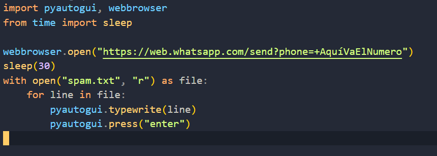

# SpanBotWhatsApp

Este script esta echo con fines de practicar como mandar mensajes precargados en un archivo para que se manden automaticamente cuando se ejecta el script

## Uso

~ Instala python desde: [Python downloads](https://www.python.org/downloads/)

~ Clone this repository

```
git clone https://github.com/luisangelponcealvarez/SpanBotWhatsApp.git
```

~ Importación de las bibliotecas necesarias:

```
pip install pyautogui
```

```
pip install webbrowser
```

```
pip install time
```

~ Ejecutar el script

Antes de ejecutar el script nesecitamos tener el texto en el archivo spam.txt para que el archivo main.py hagare el archivo spam.txt por que el texto en el archivo spam.txt es el que se va a mandar al numero que pongamos en la url en el archivo main.py la url es la siguiente https://web.whatsapp.com/send?phone=+AquíVaElNumero donde dice AquíVaElNumero ayí pondran el numero de telefono que quieran mandar el texto que esta en al archivo spam.txt.

~ Ya cuando los pasos anteriores esten ya podemos ejecutar el script con el siguiente comando

```
py main.py
```

## Miniatura


