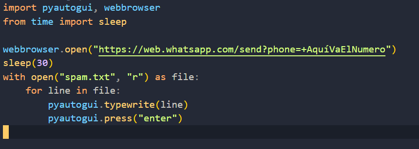

# SpanBotWhatsApp

This script is made for the purpose of practicing how to send preloaded messages in a file to be sent automatically when the script is ejected

## Use

~ Install python from: [Python downloads](https://www.python.org/downloads/)

~ Clone this repository

```
git clone https://github.com/luisangelponcealvarez/SpanBotWhatsApp.git
```

~ Import the necessary libraries:

```
pip install pyautogui
```

```
pip install webbrowser
```

```
pip install time
```

~ Run the script

Before running the script we need to have the text in the spam.txt file so that the main.py file will make the spam.txt file because the text in the spam.txt file is what will be sent to the number we put in the url in the main.py file the url is the following https://web.whatsapp.com/send?phone=+AquíVaElNumero where it says AquíVaElNumero there you will put the phone number you want to send the text that is in the spam.txt file.

~ Once the previous steps are already we can run the script with the following command

```
py main.py
```

## Thumbnail


